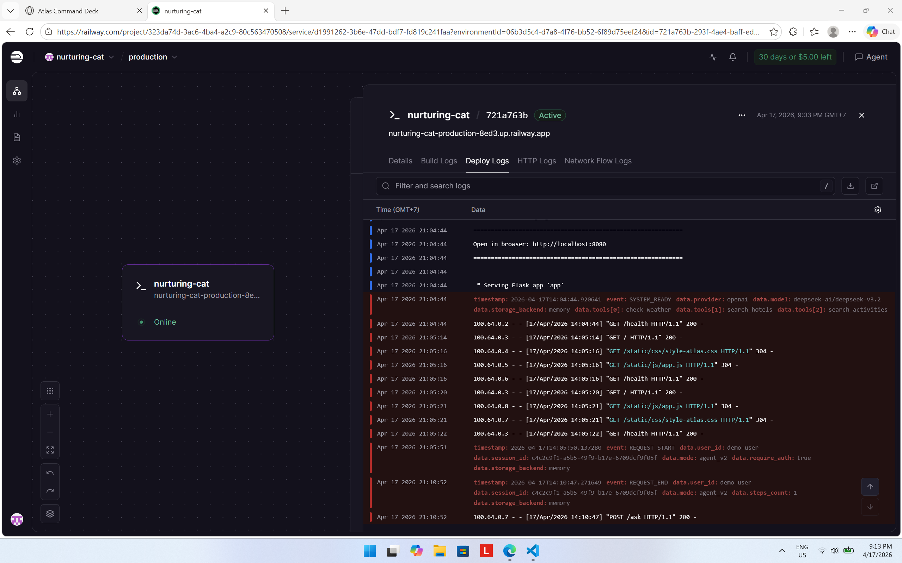
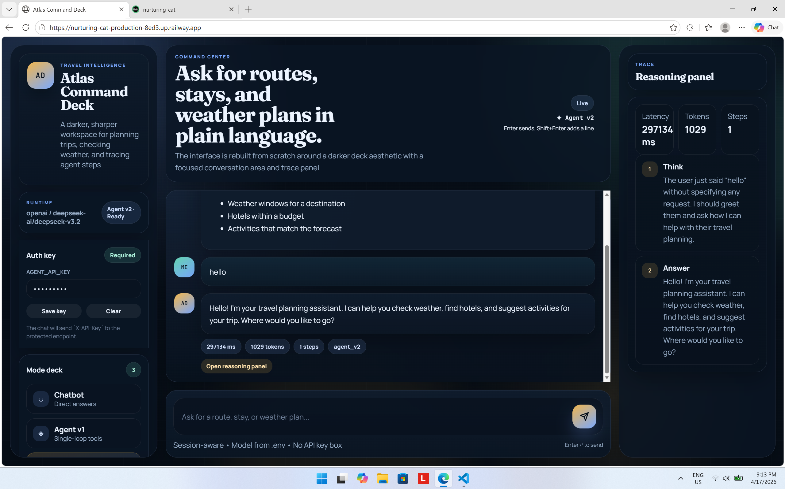
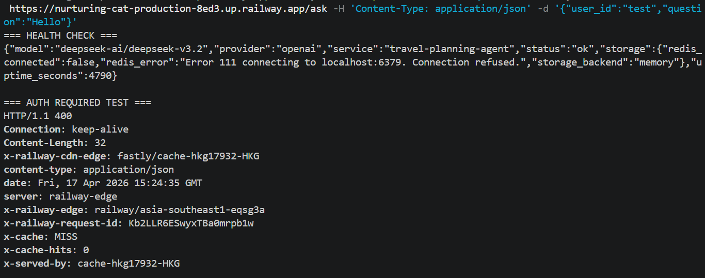

# Deployment Information

> **Student Name:** Lương Anh Tuấn  
> **Student ID:** 2A202600113  
> **Date:** _17/04/2026_

## Public URL

https://nurturing-cat-production-8ed3.up.railway.app/

## Platform

Railway

## Test Commands

### Health Check

```bash
curl https://nurturing-cat-production-8ed3.up.railway.app/health
```

Expected: `{"status":"ok"}`

### Readiness Check

```bash
curl https://nurturing-cat-production-8ed3.up.railway.app/ready
```

### Public Chat Endpoint

```bash
curl -X POST https://nurturing-cat-production-8ed3.up.railway.app/api/chat \
	-H "Content-Type: application/json" \
	-d '{"message":"Hello","mode":"chatbot"}'
```

### Protected Ask Endpoint

```bash
curl -X POST https://nurturing-cat-production-8ed3.up.railway.app/ask \
	-H "X-API-Key: YOUR_KEY" \
	-H "X-User-Id: test-user" \
	-H "Content-Type: application/json" \
	-d '{"question":"Hello","session_id":"test-session"}'
```

### Session Lookup

```bash
curl https://nurturing-cat-production-8ed3.up.railway.app/api/sessions/test-session
```

## Environment Variables Used

- `PORT`
- `AGENT_API_KEY`
- `REDIS_URL`
- `ENVIRONMENT`
- `DEFAULT_PROVIDER`
- `LOG_LEVEL`
- `RATE_LIMIT_PER_MINUTE`
- `MONTHLY_BUDGET_USD`

## Screenshots




