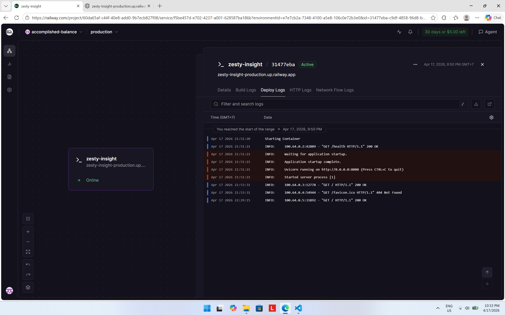
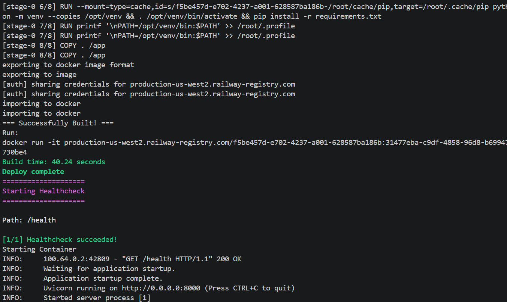

# Day 12 Lab - Mission Answers

## Part 1: Localhost vs Production

### Exercise 1.1: Anti-patterns found
1. API key và database URL bị hardcode trong source code.
2. Không có health check endpoint để platform kiểm tra tình trạng ứng dụng.
3. Bật `debug=True` và `reload=True` trong môi trường chạy app.
4. Server bind vào `localhost` thay vì `0.0.0.0`, nên không phù hợp cho container/cloud.
5. Không xử lý graceful shutdown khi nhận SIGTERM.
6. Logging dùng `print()` và còn in cả secret ra log.
7. Port bị cố định ở `8000` thay vì đọc từ environment variable.

### Exercise 1.3: Comparison table
| Feature | Develop | Production | Why Important? |
|---------|---------|------------|----------------|
| Config | Hardcode trong code | Đọc từ environment variables qua `Settings` | Dễ thay đổi theo môi trường và tránh lộ secrets |
| Secrets | Có API key hardcode | Lấy từ `AGENT_API_KEY` / `OPENAI_API_KEY` | Bảo mật tốt hơn, dễ rotate key |
| Port | Cố định `8000` | Lấy từ `PORT` env var | Phù hợp với Railway/Render và container runtime |
| Health check | Không có | Có `GET /health` | Platform biết app còn sống để restart khi cần |
| Readiness check | Không có | Có `GET /ready` | Chỉ nhận traffic khi app thật sự sẵn sàng |
| Logging | `print()` | Structured JSON logging | Dễ parse, monitor, và tìm lỗi trong production |
| Shutdown | Không xử lý SIGTERM | Graceful shutdown | Không làm rơi request đang xử lý |
| Binding | `localhost` | `0.0.0.0` | App truy cập được từ bên ngoài container |

## Part 2: Docker

### Exercise 2.1: Dockerfile questions
1. Base image: `python:3.11` trong develop/Dockerfile, và `python:3.11-slim` cho builder/runtime trong production/Dockerfile.
2. Working directory: `/app`.
3. `COPY requirements.txt` trước để tận dụng Docker layer cache; khi code thay đổi thì layer cài dependencies không phải build lại.
4. `CMD` là lệnh mặc định khi container start, còn `ENTRYPOINT` là lệnh cố định hơn, thường dùng làm executable chính của container.

### Exercise 2.3: Image size comparison
- Develop: 1.66 GB
- Production: 236 MB
- Difference: khoảng 86% nhỏ hơn

## Part 3: Cloud Deployment

### Exercise 3.1: Railway deployment
- URL: https://zesty-insight-production.up.railway.app/
- Screenshot:




## Part 4: API Security

### Exercise 4.1-4.3: Test results
- Basic API Key auth:
	- No key → `401 Unauthorized` with `Missing API key. Include header: X-API-Key: <your-key>`
	- Wrong key → `403 Forbidden` with `Invalid API key.`
	- Valid key → `200 OK` and returns the mock LLM answer
- JWT auth:
	- `POST /auth/token` with `student / demo123` returns a valid JWT access token
	- `POST /ask` with `Authorization: Bearer <token>` returns `200 OK`
	- Response includes usage info such as `requests_remaining: 9` and `budget_remaining_usd`
- Rate limiting:
	- Sliding window limit for a normal user is `10 req/min`
	- In the burst test, the first 8 requests after the earlier usage returned `200`, then the next requests returned `429`
	- Error body includes `error: Rate limit exceeded` and `retry_after_seconds`

### Exercise 4.4: Cost guard implementation
- `cost_guard.py` tracks usage per user per day in memory with `UsageRecord`
- Cost is computed from input and output token counts using fixed mock token prices
- Per-user budget is `$1/day` and global budget is `$10/day`
- `check_budget()` is called before the LLM request
- `record_usage()` is called after the LLM response to accumulate tokens and cost
- If the per-user budget is exceeded, the code raises `402 Payment Required`
- If the global budget is exceeded, the code raises `503 Service temporarily unavailable`

## Part 5: Scaling & Reliability

### Exercise 5.1-5.5: Implementation notes
- Health check:
	- `/health` returns `{"status":"ok"}` plus instance and uptime information
	- Local verification on `production/app.py` returned `200 OK`
- Readiness check:
	- `/ready` returns `{"ready": true}` when the app has finished startup
	- Local verification returned `200 OK`
- Graceful shutdown:
	- The app uses `lifespan()` startup/shutdown hooks
	- On shutdown, it waits for in-flight requests to finish before exiting
	- `SIGTERM` and `SIGINT` are logged for observability
- Stateless design:
	- Conversation history is stored in Redis when available
	- In this workspace Redis is not available, so the app falls back to in-memory storage with a warning
	- Local `/chat` verification showed session history preserved across multiple turns
- Load balancing:
	- `nginx.conf` proxies traffic to the `agent` upstream and adds `X-Served-By`
	- `docker-compose.yml` is intended to run `agent`, `redis`, and `nginx` with 3 replicas for the agent
	- The compose file references `05-scaling-reliability/advanced/Dockerfile`, but that folder is not present in this workspace, so the full Docker Compose scale test could not be run here
- Local test result:
	- `GET /health` → `200 OK`
	- `GET /ready` → `200 OK`
	- `POST /chat` preserved a session with 4 messages after two turns
	- `storage` reported `in-memory` because Redis was unavailable in the workspace

## Full Source Code - Lab 06 Complete

```text
06-lab-complete/
├── app.py                   # Main application
├── check_production_ready.py
├── Dockerfile               # Multi-stage build
├── docker-compose.yml       # Full stack
├── production_support.py    # Config, auth, rate limit, budget, storage
├── railway.toml             # Railway config
├── render.yaml              # Render config
├── requirements.txt         # Dependencies
├── README.md                # Setup instructions
├── .dockerignore            # Docker ignore
├── .env.example             # Environment template
├── logs/
│   └── 2026-04-17.log
├── nginx/
│   └── nginx.conf
├── src/
│   ├── chatbot.py
│   ├── run_agent.py
│   ├── run_evaluation.py
│   ├── agent/
│   │   └── agent.py
│   ├── core/
│   │   ├── gemini_provider.py
│   │   ├── llm_provider.py
│   │   ├── local_provider.py
│   │   └── openai_provider.py
│   ├── telemetry/
│   │   ├── logger.py
│   │   └── metrics.py
│   └── tools/
│       ├── check_weather.py
│       ├── search_activities.py
│       ├── search_hotels.py
│       ├── tool_registry.py
│       └── __init__.py
├── static/
│   ├── css/
│   │   ├── style-atlas.css
│   │   └── style.css
│   └── js/
│       └── app.js
├── templates/
│   └── index.html
└── utils/
    ├── __init__.py
    └── mock_llm.py
```

### Source code notes
- `06-lab-complete/app.py` is the deployed production entry point in this workspace.
- `06-lab-complete/production_support.py` provides config, auth, rate limiting, budget guard, and state storage.
- `06-lab-complete/Dockerfile` uses a multi-stage build.
- `06-lab-complete/docker-compose.yml` defines Redis, the agent, and Nginx for the full stack.
- `06-lab-complete/railway.toml` and `06-lab-complete/render.yaml` cover platform deployment.
- `06-lab-complete/README.md` documents the local setup and runtime behavior.

